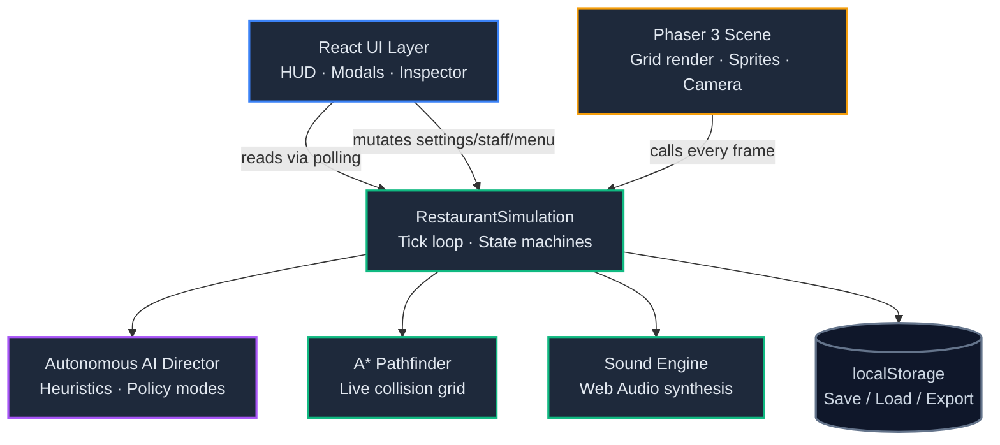
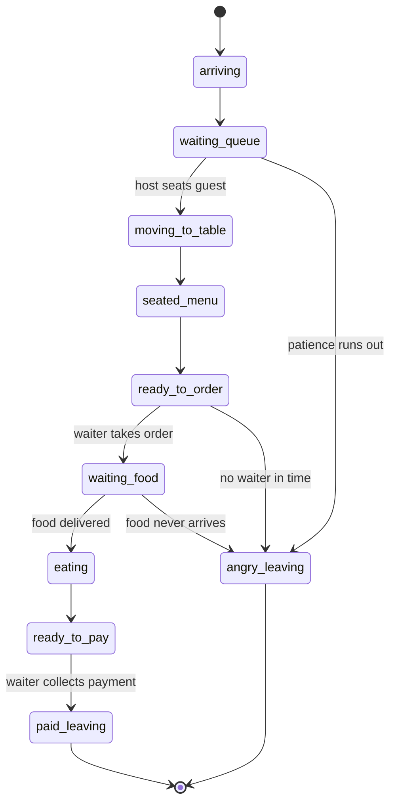

# 🍽️ ChefAI: Autonomous Restaurant Simulator

A 2D top-down restaurant management simulator built with **React**, **Phaser 3**, and **TypeScript**. Staff and guests are driven entirely by autonomous state machines and A* pathfinding — you design the floorplan, hire and customize staff, craft the menu, and tune an AI Director that runs day-to-day operations for you.

**🔗 Live demo: [cptnope.github.io/restaurant-sim-pwa](https://cptnope.github.io/restaurant-sim-pwa/)**

For a deep technical dive into the simulation engine, state machines, and rendering pipeline, see **[docs/ARCHITECTURE.md](docs/ARCHITECTURE.md)**.

---

## ✨ Features

| Feature | Description |
|---|---|
| 🧠 **Autonomous simulation** | Guests and staff run on independent finite-state machines — no scripted paths, everything emerges from the tick loop |
| 🗺️ **A\* pathfinding** | Every character navigates a live collision grid that updates as furniture is placed or removed |
| 🏗️ **Floorplan editor** | Drag-and-drop kitchen equipment, dining tables, bar and decor onto a 16×16 grid |
| 👥 **Staff customization studio** | Hire hosts, waiters, chefs, and bussers; tune stats (speed, cooking, charisma, stamina, cleanliness) and appearance |
| 📋 **Menu & recipe editor** | Create dishes with prep stations, prep time, cost, price, and popularity that directly drive guest ordering behavior |
| 🤖 **AI Director** | A background heuristics engine that auto-hires, auto-restocks, and rebalances staff under 4 selectable policy modes |
| 🎟️ **Live order ticket tracker** | Real-time kitchen ticket board showing ordered → cooking → ready → served |
| ⭐ **Daily ledger & reviews** | Procedurally generated guest reviews, tips, and a rolling reputation score |
| 🔊 **Procedural audio** | All sound effects are synthesized live via the Web Audio API — zero audio files |
| 📱 **Installable PWA** | Manifest + service worker for offline-capable, installable play |
| 💾 **Save / load** | Auto-persists to `localStorage`, plus JSON export/import for sharing a save |

---

## 🏗️ Architecture at a Glance



React never renders game entities directly — Phaser owns the canvas and reads simulation state every frame, while React polls the same singleton `simulation` object on an interval to drive the HUD and modals. See **[Architecture: High-Level Design](docs/ARCHITECTURE.md#1-high-level-architecture)** for the full breakdown.

---

## 🎮 Controls

| Input | Action |
|---|---|
| `Space` | Pause / resume simulation |
| `1` / `2` / `5` | Set game speed to 1×, 2.5×, 5× |
| `F` | Toggle Floorplan Editor |
| `S` | Toggle Staff Editor |
| `M` | Toggle Menu Editor |
| `T` | Toggle Live Order Tickets |
| `R` | Toggle Daily Report & Reviews |
| Left click | Select a guest, staff member, or object |
| Right-click drag / Shift + drag | Pan camera |
| Scroll wheel | Zoom camera (0.7×–2.0×) |

---

## 🗂️ Project Structure

```
.
├── .github/workflows/deploy.yml   # CI: build & deploy to GitHub Pages
├── public/                        # PWA manifest, service worker, icon
├── src/
│   ├── App.tsx                    # Root component: modal state, hotkeys
│   ├── main.tsx                   # React entrypoint
│   ├── types/restaurant.ts        # All shared TypeScript types
│   ├── simulation/
│   │   ├── RestaurantSimulation.ts  # Core engine: guest/staff FSMs, economy
│   │   ├── AutonomousAI.ts          # AI Director heuristics
│   │   ├── aStar.ts                 # A* pathfinding over the collision grid
│   │   └── SoundEngine.ts           # Procedural Web Audio sound effects
│   ├── phaser/
│   │   ├── PhaserContainer.tsx      # React ↔ Phaser bridge component
│   │   ├── RestaurantScene.ts       # Phaser scene: render loop, sprite maps
│   │   └── SpriteGenerator.ts       # Procedural canvas-drawn textures
│   └── components/                # HUD and modal editors (React)
└── vite.config.ts                 # base: '/restaurant-sim-pwa/' for Pages
```

---

## 🧠 How the Simulation Works

Guests and staff each move through their own state machine, driven by a single `update(deltaMs)` tick called from the Phaser scene's `update()` loop:



Staff members run role-specific priority lists each tick (e.g. a waiter always checks *deliver ready food → collect payment → take new order → bus a dirty table*, in that order) rather than following a task queue — behavior emerges from re-evaluating priorities every frame. The full breakdown of every role, the AI Director's decision heuristics, and the rendering pipeline live in **[docs/ARCHITECTURE.md](docs/ARCHITECTURE.md)**.

---

## 🛠️ Tech Stack

| Layer | Technology |
|---|---|
| UI framework | React 19 + TypeScript 5.7 |
| Game rendering | Phaser 3 (Canvas/WebGL, procedurally generated sprites) |
| Styling | Tailwind CSS |
| Build tool | Vite 6 |
| Audio | Web Audio API (no audio assets — everything is synthesized) |
| Persistence | Browser `localStorage` + JSON export/import |
| PWA | Custom service worker + manifest |
| Hosting | GitHub Pages, deployed via GitHub Actions |

---

## 🚀 Getting Started

```bash
npm install
npm run dev
```

Open `http://localhost:3000`.

```bash
npm run build      # type-check + production build to dist/
npm run preview    # preview the production build locally
```

---

## 📦 Deployment

Every push to `main` triggers [`.github/workflows/deploy.yml`](.github/workflows/deploy.yml), which builds the app and publishes `dist/` to GitHub Pages via `actions/deploy-pages`. Because this is a project site (not a `username.github.io` root site), `vite.config.ts` sets `base: '/restaurant-sim-pwa/'` so all asset URLs, the manifest, and the service worker resolve correctly under the `/restaurant-sim-pwa/` subpath. See **[Architecture: CI/CD](docs/ARCHITECTURE.md#11-cicd--deployment)** for the full pipeline diagram.

---

## 📄 License

No license file is currently included, so default copyright applies (all rights reserved). Add a `LICENSE` file if you want to permit reuse.
