# Architecture

A technical deep dive into ChefAI's simulation engine, state machines, rendering pipeline, and deployment. For a feature overview and quick start, see the [README](../README.md).

## Table of Contents

1. [High-Level Architecture](#1-high-level-architecture)
2. [Data Model](#2-data-model)
3. [Simulation Tick Loop](#3-simulation-tick-loop)
4. [Guest State Machine](#4-guest-state-machine)
5. [Staff Role Behaviors](#5-staff-role-behaviors)
6. [Order Lifecycle](#6-order-lifecycle)
7. [A* Pathfinding](#7-a-pathfinding)
8. [Autonomous AI Director](#8-autonomous-ai-director)
9. [Rendering Pipeline (Phaser)](#9-rendering-pipeline-phaser)
10. [Persistence](#10-persistence)
11. [CI/CD & Deployment](#11-cicd--deployment)

---

## 1. High-Level Architecture

The app is split into three layers that never share rendering responsibility: **React** owns UI chrome (HUD, modals, inspector), **Phaser** owns the game canvas, and a plain TypeScript **simulation singleton** (`src/simulation/RestaurantSimulation.ts`) owns all game state. Neither React nor Phaser hold their own copy of game state — both read and mutate the same `simulation` object.

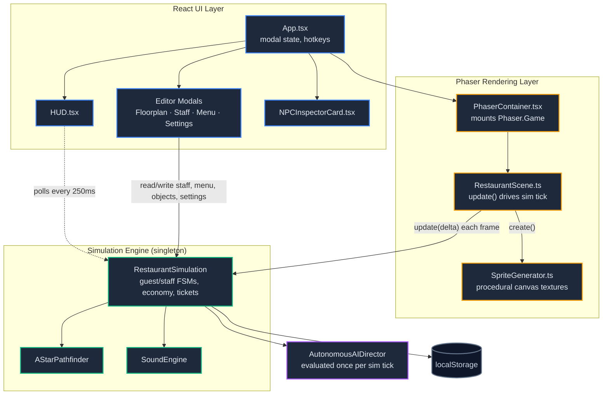

**Why polling instead of a state management library?** The simulation runs its own tick independent of React's render cycle (driven by Phaser's `update()`, not `setState`). Components that need live numbers (cash, tickets, notifications) poll the singleton on a `setInterval` (typically every 200–250ms) rather than subscribing to every mutation — simple, and cheap enough at this entity count. `RestaurantSimulation` does expose a `subscribe()`/`notifyListeners()` pub-sub for the rare cases that need it (e.g. notifications).

---

## 2. Data Model

All shared types live in [`src/types/restaurant.ts`](../src/types/restaurant.ts). The core entities:

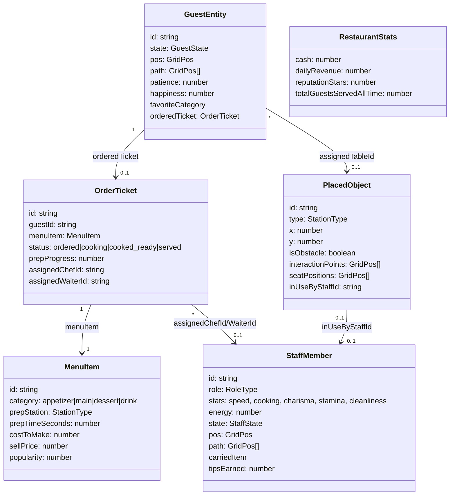

Every entity carries its own `pos` and `path: GridPos[]` — movement is not interpolated in the simulation layer itself (that happens in the Phaser render step, see [§9](#9-rendering-pipeline-phaser)); the sim just pops the next grid cell off `path` each tick.

---

## 3. Simulation Tick Loop

`RestaurantScene.update(time, delta)` calls `simulation.update(deltaMs)` every Phaser frame. One tick does, in order:

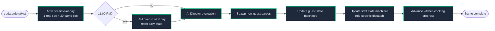

Game speed (`1×`, `2.5×`, `5×`) is a multiplier applied to `deltaSec` before any state advances, so every timer in the sim — patience drain, cook time, time-of-day — scales uniformly.

---

## 4. Guest State Machine

Guests carry a `patience` value (0–100) that drains at a state-specific rate; hitting zero in `waiting_queue`, `ready_to_order`, or `waiting_food` sends the guest to `angry_leaving` and logs a 1-star review. A successful visit ends in `paid_leaving`.

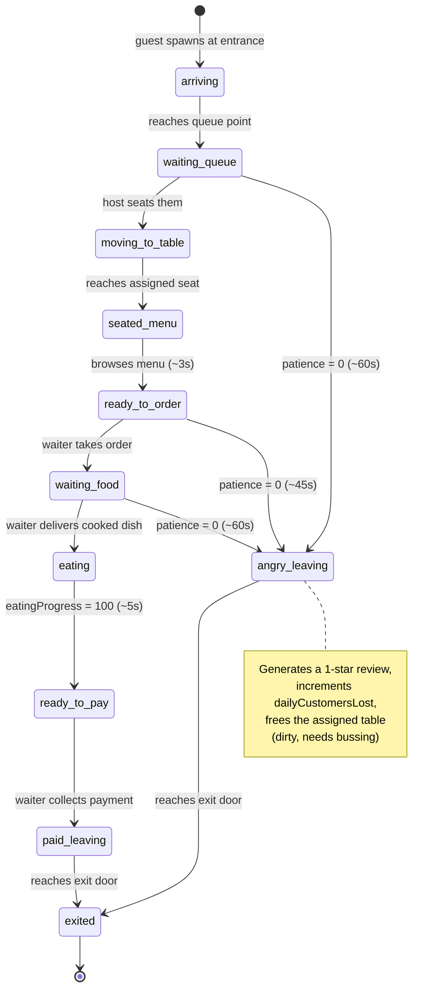

Patience resets to 100 when a guest is successfully seated (`moving_to_table` → `seated_menu`), so a long wait at the door doesn't doom an otherwise-fine dining experience.

---

## 5. Staff Role Behaviors

Staff have no task queue — every tick, an idle staff member re-evaluates a **fixed priority list** for their role and claims the first available task. This makes behavior self-healing: if a higher-priority task appears mid-tick (e.g. food becomes ready while a waiter is walking to bus a table), the *next* idle waiter picks it up rather than requiring a scheduler.

```mermaid
flowchart TD
    classDef host fill:#1e293b,stroke:#a855f7,stroke-width:2px,color:#e2e8f0
    classDef waiter fill:#1e293b,stroke:#3b82f6,stroke-width:2px,color:#e2e8f0
    classDef chef fill:#1e293b,stroke:#f59e0b,stroke-width:2px,color:#e2e8f0
    classDef busser fill:#1e293b,stroke:#10b981,stroke-width:2px,color:#e2e8f0

    subgraph Host["Host"]
        H1["Idle?"]:::host --> H2["Find queued guest +<br/>clean table"]:::host --> H3["Seat guest"]:::host
    end

    subgraph Waiter["Waiter / Bartender / Manager"]
        W1["Idle?"]:::waiter --> WA["A: Deliver cooked_ready ticket"]:::waiter
        WA -- none --> WB["B: Collect payment from<br/>ready_to_pay guest"]:::waiter
        WB -- none --> WC["C: Take order from<br/>ready_to_order guest"]:::waiter
        WC -- none --> WD["D: Bus dirty table<br/>(only if no busser hired)"]:::waiter
    end

    subgraph Chef["Chef"]
        C1["Idle?"]:::chef --> C2["Find oldest unassigned<br/>ordered ticket"]:::chef --> C3["Claim matching prep station<br/>begin cooking"]:::chef
    end

    subgraph Busser["Busser"]
        B1["Idle?"]:::busser --> B2["Find dirty table"]:::busser --> B3["Clear plates → carry to sink<br/>→ wash → idle"]:::busser
    end
```

Bartenders and managers are cross-trained onto the waiter priority list rather than having dedicated behavior. Cooking speed and bus/wash speed scale with a staff member's `cooking` and `cleanliness` stats respectively; `charisma` feeds directly into tip percentage at checkout.

---

## 6. Order Lifecycle

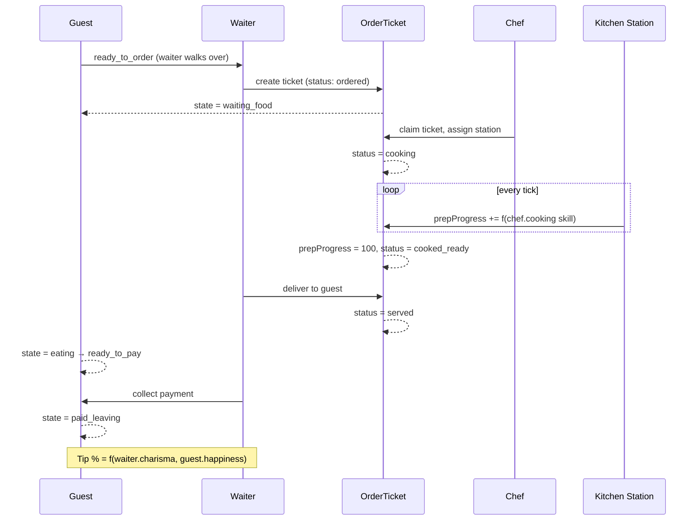

Cook time is `menuItem.prepTimeSeconds / (chef.stats.cooking / 10)` — a chef with `cooking: 10` cooks at the dish's base rate; lower-skilled chefs take proportionally longer.

---

## 7. A* Pathfinding

[`AStarPathfinder`](../src/simulation/aStar.ts) runs a textbook 4-directional A* over a boolean collision grid rebuilt from wall tiles + every `isObstacle` object's footprint. It's recomputed whenever the floorplan changes (`simulation.updateCollisionGrid()`).

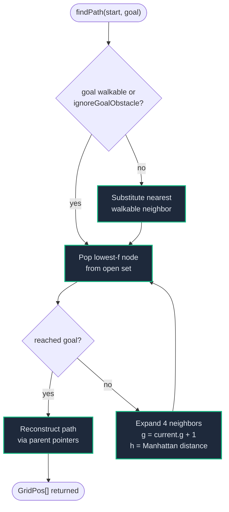

`ignoreGoalObstacle` lets a character path *to the tile occupied by* a table or station (since furniture is itself an obstacle) rather than only to its neighbors — used whenever the destination is an interaction point that's already known to be adjacent-walkable.

---

## 8. Autonomous AI Director

[`AutonomousAIDirector`](../src/simulation/AutonomousAI.ts) runs a bottleneck analysis every 2 simulated seconds and can spend the restaurant's cash autonomously (auto-hiring, auto-restocking) when policies allow it.

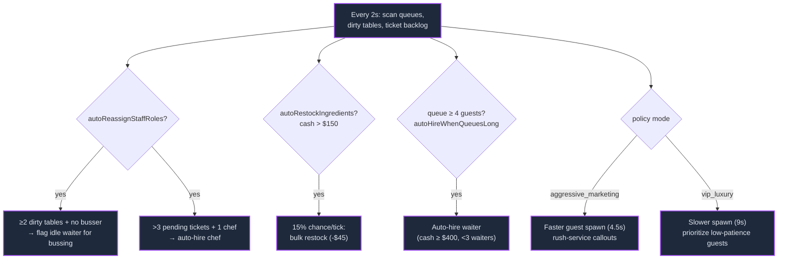

| Policy Mode | Guest Spawn Interval | Behavior |
|---|---|---|
| `balanced` | 7.0s | Default heuristics only |
| `aggressive_marketing` | 4.5s | Higher volume, surfaces rush-service notices |
| `vip_luxury` | 9.0s | Lower volume, prioritizes lowest-patience guests |
| `budget_saver` | 7.0s | Same as balanced, spend-side toggles apply less aggressively |

Every AI action (hire, restock) is logged as a HUD notification so the player can see what the director did and why.

---

## 9. Rendering Pipeline (Phaser)

[`RestaurantScene`](../src/phaser/RestaurantScene.ts) never stores its own copy of positions — every frame it reads `simulation.staff` / `simulation.guests` / `simulation.objects` directly and reconciles three `Map<id, spriteEntry>` caches (create on first sight, destroy on disappearance, `Phaser.Math.Linear` lerp toward the sim's grid position otherwise). This is what makes movement look smooth even though the simulation itself moves entities in discrete grid steps.

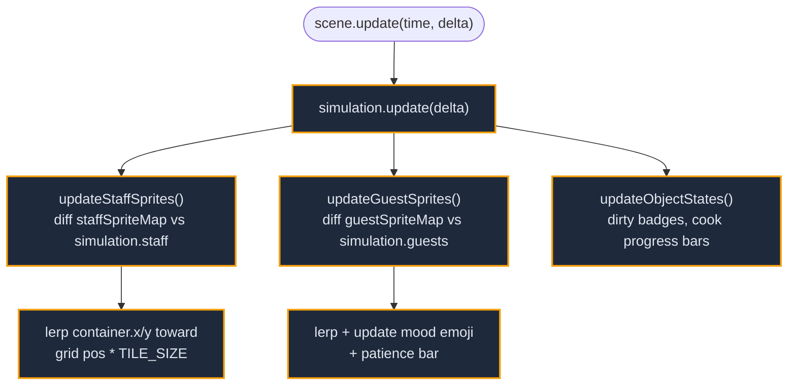

All textures — floor tiles, furniture, character avatars — are drawn procedurally onto `Phaser.Textures.CanvasTexture` at scene `create()` time via [`SpriteGenerator`](../src/phaser/SpriteGenerator.ts) (2D canvas `fillRect`/`fillText` calls), so the project ships **zero binary art assets**. Staff and guest avatars are generated per-entity from their `AvatarAppearance` (skin/hair/shirt/pants colors, hair style), so no two characters look alike by default.

Camera controls are wired directly on `this.input` in `create()`, with separate code paths for mouse and touch since Phaser reports both through the same `pointerdown`/`pointermove`/`pointerup` events:

| Input | Desktop (mouse/trackpad) | Mobile (touch) |
|---|---|---|
| Zoom | Scroll wheel, ±0.1 per notch | Two-finger pinch, scaled continuously from the pinch-start distance |
| Pan | Right-click drag, middle-click drag, or Shift+drag | Single-finger drag |
| Select | Left click on a sprite | Tap on a sprite |

Touch pointers are distinguished from mouse pointers via `pointer.wasTouch`, and the game is configured with `input.activePointers: 3` (see [`PhaserContainer.tsx`](../src/phaser/PhaserContainer.tsx)) so Phaser tracks a second and third simultaneous touch instead of discarding them — the default is a single active pointer, which would make pinch gestures invisible to the input system entirely.

A single-finger touch doesn't start panning immediately: the scene tracks the distance moved since `pointerdown` and only begins scrolling the camera once it crosses an 8px threshold. Below that threshold the gesture is treated as a tap, so a quick touch on a guest or staff sprite still fires that sprite's own `pointerdown` selection handler instead of being swallowed by camera panning. When a second finger touches down mid-drag, the gesture switches to pinch-zoom and single-finger pan state resets; lifting back to one finger resumes panning from that finger's current position.

Native browser gestures (page pinch-zoom, pull-to-refresh, double-tap-to-zoom) are disabled globally via `touch-action: none` on `<body>` (in [`index.css`](../src/index.css)) plus `user-scalable=no` on the viewport meta tag, so they never compete with the custom camera gestures above.

---

## 10. Persistence

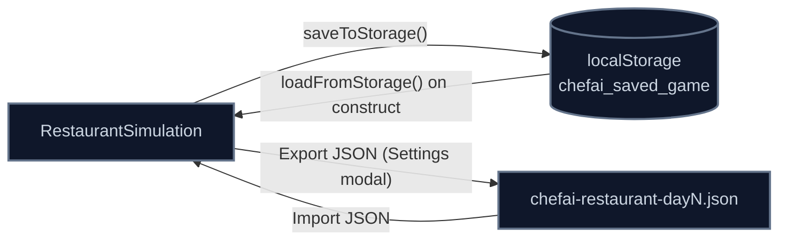

Save payload includes stats, staff, menu, floorplan objects, AI settings, and reviews — enough to fully reconstruct a session (time-of-day and in-progress guests/tickets are intentionally *not* persisted, so every load resumes at 11:00 AM with an empty dining room).

---

## 11. CI/CD & Deployment

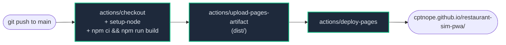

Because this is a **project site** (served under a subpath, not a `*.github.io` root), three things had to account for the `/restaurant-sim-pwa/` base path:

- `vite.config.ts` sets `base: '/restaurant-sim-pwa/'` — Vite rewrites every asset URL in `index.html` at build time.
- `public/manifest.json` uses `start_url`/`scope: "./"` and a relative icon path, so the PWA installs scoped to the subpath instead of the domain root.
- `public/sw.js` caches relative paths (`./`, `./index.html`, …) instead of absolute ones, since an absolute `/index.html` would resolve to the GitHub Pages *user* root and 404.

The workflow requests `pages: write` and `id-token: write` permissions and deploys via GitHub's official OIDC-based Pages action — no personal access token or deploy key required.
